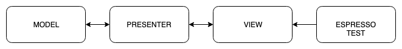
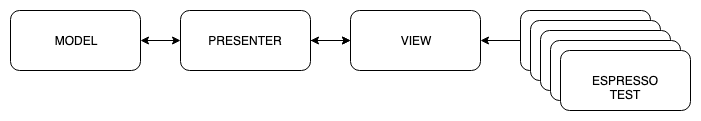
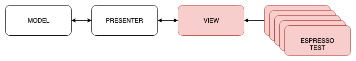
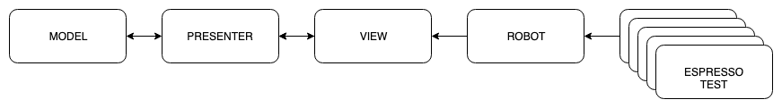
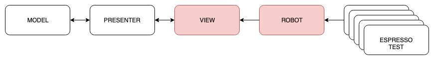
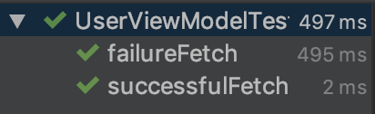

slidenumbers: true
autoscale: true
footer: @AdamMc331<br/>#DroidconUK
build-lists: true

## Espresso Patronum:<br/>The Magic of the Robot Pattern

### Adam McNeilly - @AdamMc331

^ Introduce yourself, walk through talk. 

---

# What Is Espresso?

Use Espresso to write concise, beautiful, and reliable Android UI tests[^1].

[^1]: https://developer.android.com/training/testing/espresso/index.html

---

# Three Classes To Know

- ViewMatchers
- ViewActions
- ViewAssertions

---

# ViewMatchers

- `withId(...)`
- `withText(...)`
- `isFocusable()`
- `isChecked()`

---

# ViewActions

- `typeText(...)`
- `scrollTo()`
- `swipeLeft()`
- `click()`

---

# ViewAssertions

- `matches(Matcher)`
- `isLeftOf(Matcher)`
- `doesNotExist()`

---

# Espresso Example

```kotlin
// onView gives us a ViewInteraction where we can perform an action
// or check an assertion.
onView(ViewMatcher)
	.perform(ViewAction)
	.check(ViewAssertion)
```

---

# Espresso Example

```kotlin
// Type into an EditText, verify it appears in a TextView
onView(withId(R.id.etInput)).perform(typeText("Adam"))
onView(withId(R.id.tvOutput)).check(matches(withText("Adam")))
```

---

# Sample App


---

# Happy Path Test

```kotlin
@Test
fun testSuccessfulRegistration() {
    onView(withId(R.id.etFirstName)).perform(typeText("Adam"))
    onView(withId(R.id.etLastName)).perform(typeText("McNeilly"))
    onView(withId(R.id.etEmail)).perform(typeText("adam@testing.com"))
    onView(withId(R.id.etPhone)).perform(typeText("1234567890"))
    onView(withId(R.id.registerButton)).perform(click())

    onView(withId(R.id.tvFullName)).check(matches(withText("Adam McNeilly")))
    onView(withId(R.id.tvEmailAddress)).check(matches(withText("adam@testing.com")))
    onView(withId(R.id.tvPhoneNumber)).check(matches(withText("(123)-456-7890")))
}
```

---

# Test Leaving Out A Field

```kotlin
@Test
fun testMissingEmailError() {
	onView(withId(R.id.etFirstName)).perform(typeText("Adam"))
    onView(withId(R.id.etLastName)).perform(typeText("McNeilly"))
    onView(withId(R.id.etPhone)).perform(typeText("1234567890"))
    onView(withId(R.id.registerButton)).perform(click())

    onView(withId(R.id.etEmail)).check(matches(hasErrorText("Must enter an email address.")))
}
```

---

# Test An Invalid Field

```kotlin
@Test
fun testInvalidEmailError() {
    onView(withId(R.id.etFirstName)).perform(typeText("Adam"))
    onView(withId(R.id.etLastName)).perform(typeText("McNeilly"))
    onView(withId(R.id.etEmail)).perform(typeText("blahblah"))
    onView(withId(R.id.etPhone)).perform(typeText("1234567890"))
    onView(withId(R.id.registerButton)).perform(click())

    onView(withId(R.id.etEmail)).check(matches(hasErrorText("Must enter a valid email address.")))
}
```

---

# All Together

```kotlin
@Test
fun testSuccessfulRegistration() {
    onView(withId(R.id.etFirstName)).perform(typeText("Adam"))
    onView(withId(R.id.etLastName)).perform(typeText("McNeilly"))
    onView(withId(R.id.etEmail)).perform(typeText("adam@testing.com"))
    onView(withId(R.id.etPhone)).perform(typeText("1234567890"))
    onView(withId(R.id.registerButton)).perform(click())

    onView(withId(R.id.tvFullName)).check(matches(withText("Adam McNeilly")))
    onView(withId(R.id.tvEmailAddress)).check(matches(withText("adam@testing.com")))
    onView(withId(R.id.tvPhoneNumber)).check(matches(withText("(123)-456-7890")))
}

@Test
fun testMissingEmailError() {
    onView(withId(R.id.etFirstName)).perform(typeText("Adam"))
    onView(withId(R.id.etLastName)).perform(typeText("McNeilly"))
    onView(withId(R.id.etPhone)).perform(typeText("1234567890"))
    onView(withId(R.id.registerButton)).perform(click())

    onView(withId(R.id.etEmail)).check(matches(hasErrorText("Must enter an email address.")))
}

@Test
fun testInvalidEmailError() {
    onView(withId(R.id.etFirstName)).perform(typeText("Adam"))
    onView(withId(R.id.etLastName)).perform(typeText("McNeilly"))
    onView(withId(R.id.etEmail)).perform(typeText("blahblah"))
    onView(withId(R.id.etPhone)).perform(typeText("1234567890"))
    onView(withId(R.id.registerButton)).perform(click())

    onView(withId(R.id.etEmail)).check(matches(hasErrorText("Must enter a valid email address.")))
}
```

---

# The Problem

* Verbose
* Difficult To Read
* Difficult To Maintain - No Separation Of Concerns

---

# No Separation Of Concerns



---

# No Separation Of Concerns



---

# No Separation Of Concerns



---

# Introducing Robots



---

# Separation Of Concerns



---

# Let's Create A Robot

```kotlin
@Test
fun testSuccessfulRegistration() {
    RegistrationRobot()
            .firstName("Adam")
            .lastName("McNeilly")
            .email("adam@testing.com")
            .phone("1234567890")
            .register()
            .assertFullNameDisplay("Adam McNeilly")
            .assertEmailDisplay("adam@testing.com")
            .assertPhoneDisplay("(123)-456-7890")
}
```

---

> Write your tests as if you're telling a Quality Assurance Engineer what to do.
--

---

# Define ViewMatchers

```kotlin
class RegistrationRobot {

    companion object {
        private val FIRST_NAME_INPUT_MATCHER = withId(R.id.etFirstName)
        private val LAST_NAME_INPUT_MATCHER = withId(R.id.etLastName)
        private val EMAIL_INPUT_MATCHER = withId(R.id.etEmail)
        private val PHONE_INPUT_MATCHER = withId(R.id.etPhone)
        private val REGISTER_INPUT_MATCHER = withId(R.id.registerButton)
    }
}
```

---

# One Method For Each Action

```kotlin
class RegistrationRobot {

    fun firstName(firstName: String): RegistrationRobot {
        onView(FIRST_NAME_MATCHER).perform(clearText(), typeText(firstName), closeSoftKeyboard())
        return this
    }

    fun register(): RegistrationRobot {
        onView(REGISTER_INPUT_MATCHER).perform(click())
        return this
    }
}
```

---

# One Method For Each Assertion

```kotlin
class RegistrationRobot {

    fun assertEmailDisplay(email: String) = apply {
        onView(EMAIL_DISPLAY_MATCHER).check(matches(withText(email)))
    }

    fun assertEmailError(error: String) = apply {
        onView(EMAIL_INPUT_MATCHER).check(matches(hasErrorText(error)))
    }
}
```

---

# Implementation

```kotlin
@Test
fun testSuccessfulRegistration() {
    RegistrationRobot()
            .firstName("Adam")
            .lastName("McNeilly")
            .email("adam@testing.com")
            .phone("1234567890")
            .register()
}
```

---

# Easy To Create Negative Test

```kotlin
@Test
fun testMissingEmailError() {
    RegistrationRobot()
            .firstName("Adam")
            .lastName("McNeilly")
            .phone("1234567890")
            .register()
            .assertEmailError("Must enter an email address.")
}
```

---

# Work Some Kotlin Magic, If You Want

```kotlin
fun registration(func: RegistrationRobot.() -> Unit) = RegistrationRobot().apply(func)

// ...

@Test
fun testSuccessfulRegistrationWithOptIn() {
    registration {
        firstName("Adam")
        lastName("McNeilly")
        email("adam@testing.com")
        phone("1234567890")
        emailOptIn()
    }.register()
}
```

---

# Best Practices

---

# Leverage Them For Better Test Reporting

```kotlin
class RegistrationRobot {

    // Take a screenshot
    fun firstName(firstName: String) = apply {
        onView(FIRST_NAME_MATCHER).perform(clearText(), typeText(firstName), closeSoftKeyboard())
        takeScreenshot("entered_first_name")
    }

    // Log the step 
    fun firstName(firstName: String) = apply {
        onView(FIRST_NAME_MATCHER).perform(clearText(), typeText(firstName), closeSoftKeyboard())
        Timber.d("Entering first name")
    }
}
```

---

# Use One Robot Per Screen

```kotlin
@Test
fun testSuccessfulRegistrationWithOptIn() {
    RegistrationRobot()
            .firstName("Adam")
            .lastName("McNeilly")
            .email("adam@testing.com")
            .phone("1234567890")
            .emailOptIn()
            .register()

    UserProfileRobot()
            .assertFullNameDisplay("Adam McNeilly")
            .assertEmailDisplay("adam@testing.com")
            .assertPhoneDisplay("(123)-456-7890")
            .assertOptedIn()
}
```

---

# Don't Chain Robots

```kotlin
// Sounds reasonable...
fun register(): UserProfileRobot {
    onView(REGISTER_INPUT_MATCHER).perform(click())
    return UserProfileRobot()
}

// Unable to run negative tests now
@Test
fun testMissingEmailError() {
    RegistrationRobot()
            .register()
            .assertEmailError("Must enter an email address.") // Undefined Method
}
```

---

# Don't Put Conditional Logic In Robot

```kotlin
// Sounds reasonable...
// But who tests the tests?
class UserProfileRobot {
    fun assertOptInStatus(optedIn: Boolean) = apply {
        val optInMatcher = if (optedIn) isChecked() else isNotChecked()
        onView(EMAIL_OPT_IN_DISPLAY_MATCHER).check(matches(optInMatcher))
    }
}
```

---

# Use Separate Methods Instead

```kotlin
class UserProfileRobot {
    fun assertOptedIn() = apply {
        onView(EMAIL_OPT_IN_DISPLAY_MATCHER).check(matches(isChecked()))
    }

    fun assertOptedOut() = apply {
        onView(EMAIL_OPT_IN_DISPLAY_MATCHER).check(matches(isNotChecked()))
    }
}
```

---

# Unit Testing With Robots

---

# ViewModel Example

```kotlin
class UserViewModel(
    private val repository: UserRepository
): ViewModel() {
    val state = MutableLiveData<NetworkState<User>>()
    
    fun fetchUser() {
        repository
            .fetchUser()
            .subscribe(
                { user ->
                    state.value = NetworkState.Loaded(user)
                },
                { error ->
                    state.value = NetworkState.Error(error)
                }
            )
    }
}
```

---

# You May Write Tests This Way

```kotlin
@Test
fun successfulFetch() {
    val mockRepository = mock(UserRepository::class.java)
    val sampleUser = User("Adam")
    whenever(mockRepository.fetchUser()).thenReturn(Single.just(sampleUser))
    
    val viewModel = UserViewModel(mockRepository)
    viewModel.fetchUser()
    val currentState = viewModel.state.testObserver().observedValue
    assertEquals(NetworkState.Loaded(sampleUser), currentState)
}
```

^ Same separation of concerns problem. What if I move state from LiveData to Rx type?

---

# Create A Robot Here Too

```kotlin
class UserViewModelRobot {
    private val mockRepository = mock(UserRepository::class.java)
    private val viewModel = UserViewModel(mockRepository)
    
    fun mockUserResponse(user: User) = apply {
        val response = Single.just(user)
        whenever(mockRepository.fetchUser()).thenReturn(response)
    }
    
    fun fetchUser() = apply {
        viewModel.fetchUser()
    }
    
    fun assertState(expectedState: NetworkState<User>) = apply {
        val currentState = viewModel.state.testObserver().observedValue
        assertEquals(expectedState, currentState)
    }
}
```

---

# Implement Robot

```kotlin
class UserViewModelTest {
    private lateinit var testRobot: UserViewModelRobot

    @Before
    fun setUp() {
        // Robot should be specific to each test
        testRobot = UserViewModelRobot()
    }

    @Test
    fun successfulFetch() {
        val sampleUser = User("Adam")
        
        testRobot
            .mockUserResponse(sampleUser)
            .fetchUser()
            .assertState(NetworkState.Loaded(sampleUser))
    }
}
```

---

# Easy To Add Error Test

```kotlin
class UserViewModelRobot {
    // ...

    fun mockUserError(error: Throwable?) = apply {
        val response = Single.error<User>(error)
        whenever(mockRepository.fetchUser()).thenReturn(response)
    }
}

class UserViewModelTest {
    // ...

    @Test
    fun failureFetch() {
        val sampleError = Throwable("Whoops")

        testRobot
            .mockUserError(sampleError)
            .fetchUser()
            .assertState(NetworkState.Error(sampleError))
    }
}
```

---

# Let's See It In Action

---

# Update Our ViewModel

```kotlin
class UserViewModel(
    private val repository: UserRepository
): ViewModel() {
    // val state = MutableLiveData<NetworkState<User>>()
    val state: BehaviorSubject<NetworkState<User>> = BehaviorSubject.create()
}
```

---

# Update One Robot Method

```kotlin
class UserViewModelRobot {
    fun assertState(expectedState: NetworkState<User>) = apply {
        // val currentState = viewModel.state.testObserver().observedValue
        val currentState = viewModel.state.value
        assertEquals(expectedState, currentState)
    }
}
```

---

# Everything Is Passing Again



---

# Recap

- Utilize robot pattern for more readable and maintainable tests
- Take advantage of this pattern to introduce better test reporting
- Don't code yourself into a corner with additional complexity
    - Don't chain robots
    - Don't include any logic in the robot methods
- This concept is not specific to Espresso, or UI testing