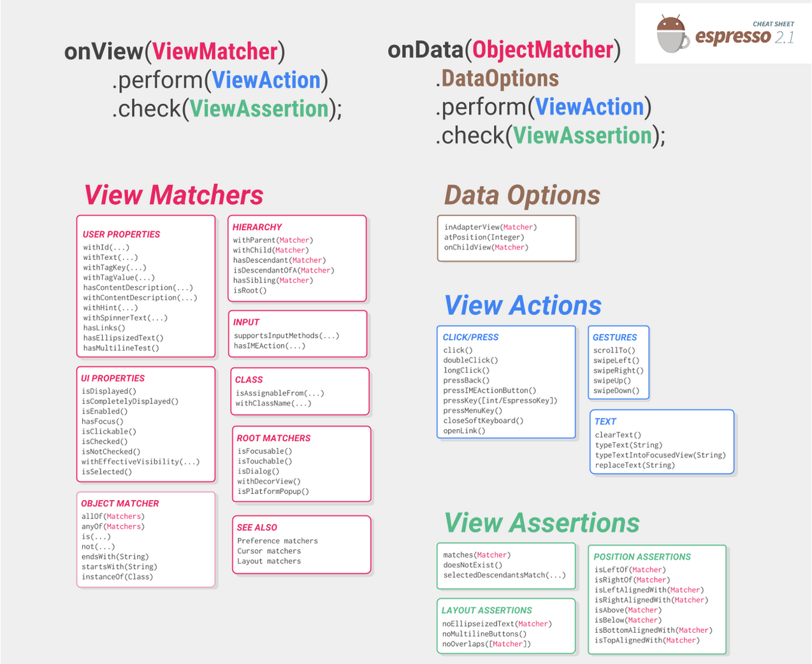
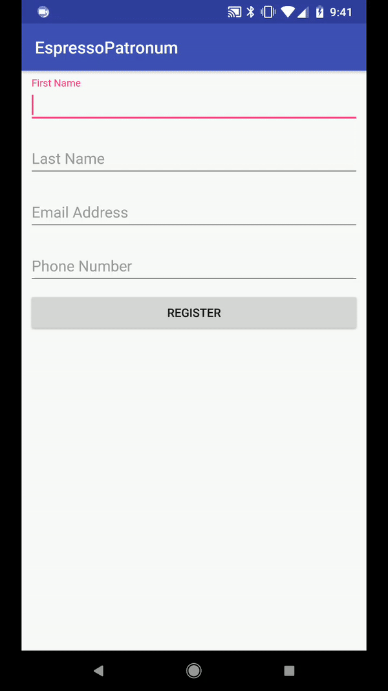
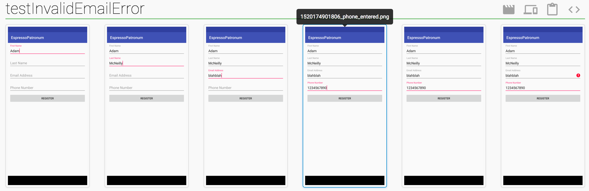

theme: Business Class
slidenumbers: true
autoscale: true
footer: @AdamMc331<br/>@NYAndroidMeetup

# Espresso Patronum: The Magic of the Robot Pattern

### Adam McNeilly: Android Engineer - OkCupid

^ Introduce yourself. Explain that we'll be talking about the benefits of using the robot pattern for clean and maintainable tests, and will include a brief introduction to Espresso for those who are not familiar with it.

---

# What is Espresso?

---

> Use Espresso to write concise, beautiful, and reliable Android UI tests[^1].

^ Espresso is an automated testing framework built by Google that lets you write code to automate your UI and make sure it behaves as you expect. Alternatives - Appium, UIAutomator. Robot pattern applies there too, even though we'll be using Espresso for today's example.

[^1]: https://developer.android.com/training/testing/espresso/index.html

---

# Three Classes To Know

1. ViewMatchers
2. ViewActions
3. ViewAssertions

[.build-lists: true]

---

# ViewMatchers

- `withId(...)`
- `withText(...)`
- `isFocusable()`
- `isChecked()`

^ ViewMatchers are used to help Espresso find a view with certain characterstics, like a specific id, text, or flag like focusable/checked.

---

# ViewActions

- `typeText(...)`
- `scrollTo()`
- `swipeLeft()`
- `click()`

^ ViewActions are used to tell Espresso to perform an action on a View. This could range from typing text to clicking a button.

---

# ViewAssertions

- `matches(Matcher)`
- `isLeftOf(Matcher)`
- `doesNotExist()`

^ These are used for the "testing" part of Espresso. Use these to make sure your view matches the characteristics that are expected.

---

# Espresso Cheatsheet[^2]



^ This is a quick cheatsheet that shows you the various classes involved in Espresso testing and the types of methods that fall within each one.

[^2]: https://developer.android.com/training/testing/espresso/cheat-sheet.html

---

# Espresso Example

```kotlin
// onView gives us a ViewInteraction where we can perform an action
// or check an assertion.
onView(ViewMatcher)
	.perform(ViewAction)
	.check(ViewAssetion)

// Type into an EditText, verify it appears in a TextView
onView(withId(R.id.etInput)).perform(typeText("Adam"))
onView(withId(R.id.tvOutput)).check(matches(withText("Adam")))
```

^ Walkthrough what's happening here. 

---

# Sample Project



^ To demonstrate how the robot pattern saves us time, we'll consider automating this registration form. It has a registration fragment, which is then replaced by a UserProfile fragment. I also think it's best to explain the robot pattern by first demonstrating the problem it solves.

---

# Test Successful Registration

```kotlin
@Test
fun testSuccessfulRegistration() {
    onView(withId(R.id.etFirstName)).perform(typeText("Adam"))
    onView(withId(R.id.etLastName)).perform(typeText("McNeilly"))
    onView(withId(R.id.etEmail)).perform(typeText("amcneilly@okcupid.com"))
    onView(withId(R.id.etPhone)).perform(typeText("1234567890"))
    onView(withId(R.id.registerButton)).perform(click())

    onView(withId(R.id.tvFullName)).check(matches(withText("Adam McNeilly")))
    onView(withId(R.id.tvEmailAddress)).check(matches(withText("amcneilly@okcupid.com")))
    onView(withId(R.id.tvPhoneNumber)).check(matches(withText("(123)-456-7890")))
}
```

^ Briefly walk through this example for testing successful registration and call out especially how verbose this is. 

---

# Test A Missing Field

```kotlin, [.highlight: 5, 9]
@Test
fun testMissingEmailError() {
	onView(withId(R.id.etFirstName)).perform(typeText("Adam"))
    onView(withId(R.id.etLastName)).perform(typeText("McNeilly"))
    // onView(withId(R.id.etEmail)).perform(typeText("amcneilly@okcupid.com"))
    onView(withId(R.id.etPhone)).perform(typeText("1234567890"))
    onView(withId(R.id.registerButton)).perform(click())

    onView(withId(R.id.etEmail)).check(matches(hasErrorText("Must enter an email address.")))
}
```

^ We always want to negative test our apps too, right?

---

# One More Negative Test

```kotlin, [.highlight: 5, 9]
@Test
fun testInvalidEmailError() {
    onView(withId(R.id.etFirstName)).perform(typeText("Adam"))
    onView(withId(R.id.etLastName)).perform(typeText("McNeilly"))
    onView(withId(R.id.etEmail)).perform(typeText("blahblah"))
    onView(withId(R.id.etPhone)).perform(typeText("1234567890"))
    onView(withId(R.id.registerButton)).perform(click())

    onView(withId(R.id.etEmail)).check(matches(hasErrorText("Must enter a valid email address.")))
}
```

^ Not only do we want to verify an error for a missing field, but we might have to check if it's invalid as well.

---

# All Together

```kotlin
@Test
fun testSuccessfulRegistration() {
    onView(withId(R.id.etFirstName)).perform(typeText("Adam"))
    onView(withId(R.id.etLastName)).perform(typeText("McNeilly"))
    onView(withId(R.id.etEmail)).perform(typeText("amcneilly@okcupid.com"))
    onView(withId(R.id.etPhone)).perform(typeText("1234567890"))
    onView(withId(R.id.registerButton)).perform(click())

    onView(withId(R.id.tvFullName)).check(matches(withText("Adam McNeilly")))
    onView(withId(R.id.tvEmailAddress)).check(matches(withText("amcneilly@okcupid.com")))
    onView(withId(R.id.tvPhoneNumber)).check(matches(withText("(123)-456-7890")))
}

@Test
fun testMissingEmailError() {
    onView(withId(R.id.etFirstName)).perform(typeText("Adam"))
    onView(withId(R.id.etLastName)).perform(typeText("McNeilly"))
    onView(withId(R.id.etPhone)).perform(typeText("1234567890"))
    onView(withId(R.id.registerButton)).perform(click())

    onView(withId(R.id.etEmail)).check(matches(hasErrorText("Must enter an email address.")))
}

@Test
fun testInvalidEmailError() {
    onView(withId(R.id.etFirstName)).perform(typeText("Adam"))
    onView(withId(R.id.etLastName)).perform(typeText("McNeilly"))
    onView(withId(R.id.etEmail)).perform(typeText("blahblah"))
    onView(withId(R.id.etPhone)).perform(typeText("1234567890"))
    onView(withId(R.id.registerButton)).perform(click())

    onView(withId(R.id.etEmail)).check(matches(hasErrorText("Must enter a valid email address.")))
}
```

---

# Downfalls Of This Approach

1. Extremely Verbose
2. Unreadable
3. Not Easily Maintainable - What if a view changes?

^ If we change our view now, we have to go rewrite every test. We've also written such verbose and tough to read code that if we're starting from scratch this doesn't make Espresso seem like so much fun. This is where I gave up the first time.

[.build-lists: true]

---

# Introducing Robots

A robot is the middle man between your view and your code. This is a way of separating concerns just like an MVC/MVP/MVWTF architecture does with your application's code.

^ Now, if a view changes, all we have to do is change our robot. Our tests will tell the robot what to do without any care about what happens underneath.

---

# Usage

```kotlin
@Test
fun testSuccessfulRegistration() {
    RegistrationRobot()
            .firstName("Adam")
            .lastName("McNeilly")
            .email("amcneilly@okcupid.com")
            .phone("1234567890")
            .register()
            .assertFullNameDisplay("Adam McNeilly")
            .assertEmailDisplay("amcneilly@okcupid.com")
            .assertPhoneDisplay("(123)-456-7890")
}
```

^ Ultimately we have the same lines of code, but this is incredibly more concise and readable.

---

# Define ViewMatchers

```kotlin, [.highlight: 4-12]
class RegistrationRobot {

    companion object {
        private val FIRST_NAME_INPUT_MATCHER = withId(R.id.etFirstName)
        private val LAST_NAME_INPUT_MATCHER = withId(R.id.etLastName)
        private val EMAIL_INPUT_MATCHER = withId(R.id.etEmail)
        private val PHONE_INPUT_MATCHER = withId(R.id.etPhone)
        private val REGISTER_INPUT_MATCHER = withId(R.id.registerButton)

        private val FULL_NAME_DISPLAY_MATCHER = withId(R.id.tvFullName)
        private val EMAIL_DISPLAY_MATCHER = withId(R.id.tvEmailAddress)
        private val PHONE_DISPLAY_MATCHER = withId(R.id.tvPhoneNumber)
    }
}
```

^ It's easiest to define each view matcher in a companion object (or a static field if you're using Java), so that they can all be managed in one place and easily changed.

---

# Each Action As A Method

```kotlin
class RegistrationRobot {

    fun firstName(firstName: String): RegistrationRobot {
        onView(FIRST_NAME_MATCHER).perform(clearText(), typeText(firstName), closeSoftKeyboard())
        return this
    }

    fun register(): RegistrationRobot {
        onView(REGISTER_INPUT_MATCHER).perform(click())
        return this
    }

    fun assertFullNameDisplay(fullName: String): RegistrationRobot {
        onView(FULL_NAME_DISPLAY_MATCHER).check(matches(withText(fullName)))
        return this
    }

    ...
}
```

^ We'll use the builder pattern to write a method for each action our robot can perform. The main benefit of using the builder pattern like this is so we can chain the calls together nicely as seen on the next slide.

---

# Benefits

1. Readibility
2. Maintainability
3. Better Test Reporting

[.build-lists: true]

---

# Better Test Reporting Using Spoon[^3]

Spoon will run all of our instrumentation tests and build us a static HTML report at the end.

^ We can leverage a tool like Spoon to make more effective test reports. Spoon is a library built and maintained by Square.

[^3]: https://github.com/square/spoon

---

# Example Spoon Report



^ This is an example of what a Spoon report would look like. What you're seeing here is our invalid email test with a screenshot of each step along the way. If I hover over a picture I'll see a description of that step. 

---

# When To Take Screenshots

* After assertions
* Before actions - unless that action leads to another screen
* On failure

[.build-lists: true]

---

# Adding Screenshots To Our Robot

```kotlin
fun firstName(firstName: String): RegistrationRobot {
    onView(FIRST_NAME_INPUT_MATCHER).perform(clearText(), typeText(firstName), closeSoftKeyboard())
    takeScreenshot(spoon, "first_name_entered")
    return this
}

fun register(): RegistrationRobot {
    takeScreenshot(spoon, "register_clicked")
    onView(REGISTER_INPUT_MATCHER).perform(click())
    return this
}

fun setFailureHandler(spoon: SpoonRule, context: Context) {
    Espresso.setFailureHandler { error, viewMatcher ->
        takeScreenshot(spoon, "test_failed")
        DefaultFailureHandler(context).handle(error, viewMatcher)
    }
}
```

^ Since we already have each step broken out into a method in our robot, we can just add a screenshot to each one with a description. You can find the actual source code for this on GitHub which I'll like to at the end, if you're curious what the takeScreenshot method looks like. See how this follows along with what was discussed on the last slide.

---

# Takeaways

1. Use the robot pattern to make your tests more maintainable.
2. Your actual tests become easier and quicker to write once you've created a robot.
3. Robots can be leveraged for additional and more thorough. 
4. This idea is not specific to Espresso or Spoon.

---

# Repository

* https://github.com/AdamMc331/EspressoPatronum

^ This will take you to a sample project that uses the robot pattern and Spoon for testing. The README will have a link to the various resources used throughout this as well.