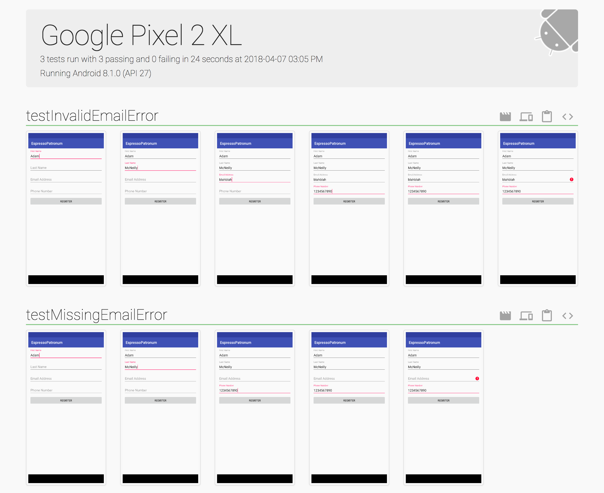

theme: Simple - Modified
slidenumbers: true
autoscale: true
footer: @AdamMc331<br/>#ChicagoRoboto

## Espresso Patronum:<br/>The Magic of the Robot Pattern

### Adam McNeilly

^ Introduce yourself. Walk through talk.

---

# What is Espresso?

---

> Use Espresso to write concise, beautiful, and reliable Android UI tests[^1].

^ Espresso is an automated testing framework built by Google that lets you write code to automate your UI and make sure it behaves as you expect. There are alternatives. Robot pattern applies to alternatives, even though we'll be using Espresso for today's example.

[^1]: https://developer.android.com/training/testing/espresso/index.html

---

# Three Classes To Know

1. ViewMatchers
2. ViewActions
3. ViewAssertions

^ Needed for examples.

---

# ViewMatchers

- `withId(...)`
- `withText(...)`
- `isFocusable()`
- `isChecked()`

^ Find view. Must be visible.

---

# ViewActions

- `typeText(...)`
- `scrollTo()`
- `swipeLeft()`
- `click()`

^ Fun part. 

---

# ViewAssertions

- `matches(Matcher)`
- `isLeftOf(Matcher)`
- `doesNotExist()`

^ Testing part.

---

# Espresso Cheatsheet[^2]


^ Breakdown. Learning Resource.

[^2]: https://developer.android.com/training/testing/espresso/cheat-sheet.html

---

# Espresso Example

```kotlin
// onView gives us a ViewInteraction where we can perform an action
// or check an assertion.
onView(ViewMatcher)
	.perform(ViewAction)
	.check(ViewAssertion)
```

^ Walkthrough. Docs so far. 

---

# Espresso Example

```kotlin
// Type into an EditText, verify it appears in a TextView
onView(withId(R.id.etInput)).perform(typeText("Adam"))
onView(withId(R.id.tvOutput)).check(matches(withText("Adam")))
```

^ Walkthrough.

---

# Sample Project


^ Explain Sample.

---

# The Problem 

Before we introduce robots, let's take a look at the problem it solves.

^ Consider tests. Write them. Explain why.

---

# Test Successful Registration

```kotlin
@Test
fun testSuccessfulRegistration() {
    onView(withId(R.id.etFirstName)).perform(typeText("Adam"))
    onView(withId(R.id.etLastName)).perform(typeText("McNeilly"))
    onView(withId(R.id.etEmail)).perform(typeText("amcneilly@okcupid.com"))
    onView(withId(R.id.etPhone)).perform(typeText("1234567890"))
    onView(withId(R.id.registerButton)).perform(click())

    onView(withId(R.id.tvFullName)).check(matches(withText("Adam McNeilly")))
    onView(withId(R.id.tvEmailAddress)).check(matches(withText("amcneilly@okcupid.com")))
    onView(withId(R.id.tvPhoneNumber)).check(matches(withText("(123)-456-7890")))
}
```

^ Walkthrough. Verbose but well named methods.

---

# Test A Missing Field

```kotlin
@Test
fun testMissingEmailError() {
	onView(withId(R.id.etFirstName)).perform(typeText("Adam"))
    onView(withId(R.id.etLastName)).perform(typeText("McNeilly"))
    onView(withId(R.id.etPhone)).perform(typeText("1234567890"))
    onView(withId(R.id.registerButton)).perform(click())

    onView(withId(R.id.etEmail)).check(matches(hasErrorText("Must enter an email address.")))
}
```

^ Hard to see difference.

---

# One More Negative Test

```kotlin
@Test
fun testInvalidEmailError() {
    onView(withId(R.id.etFirstName)).perform(typeText("Adam"))
    onView(withId(R.id.etLastName)).perform(typeText("McNeilly"))
    onView(withId(R.id.etEmail)).perform(typeText("blahblah"))
    onView(withId(R.id.etPhone)).perform(typeText("1234567890"))
    onView(withId(R.id.registerButton)).perform(click())

    onView(withId(R.id.etEmail)).check(matches(hasErrorText("Must enter a valid email address.")))
}
```

^ Hard to see difference. Verbose, but well named.

---

# All Together

```kotlin
@Test
fun testSuccessfulRegistration() {
    onView(withId(R.id.etFirstName)).perform(typeText("Adam"))
    onView(withId(R.id.etLastName)).perform(typeText("McNeilly"))
    onView(withId(R.id.etEmail)).perform(typeText("amcneilly@okcupid.com"))
    onView(withId(R.id.etPhone)).perform(typeText("1234567890"))
    onView(withId(R.id.registerButton)).perform(click())

    onView(withId(R.id.tvFullName)).check(matches(withText("Adam McNeilly")))
    onView(withId(R.id.tvEmailAddress)).check(matches(withText("amcneilly@okcupid.com")))
    onView(withId(R.id.tvPhoneNumber)).check(matches(withText("(123)-456-7890")))
}

@Test
fun testMissingEmailError() {
    onView(withId(R.id.etFirstName)).perform(typeText("Adam"))
    onView(withId(R.id.etLastName)).perform(typeText("McNeilly"))
    onView(withId(R.id.etPhone)).perform(typeText("1234567890"))
    onView(withId(R.id.registerButton)).perform(click())

    onView(withId(R.id.etEmail)).check(matches(hasErrorText("Must enter an email address.")))
}

@Test
fun testInvalidEmailError() {
    onView(withId(R.id.etFirstName)).perform(typeText("Adam"))
    onView(withId(R.id.etLastName)).perform(typeText("McNeilly"))
    onView(withId(R.id.etEmail)).perform(typeText("blahblah"))
    onView(withId(R.id.etPhone)).perform(typeText("1234567890"))
    onView(withId(R.id.registerButton)).perform(click())

    onView(withId(R.id.etEmail)).check(matches(hasErrorText("Must enter a valid email address.")))
}
```

^ A lot of code. Not just small.

---

# The Problem

1. Extremely Verbose & Unreadable
2. Not Easy To Maintain

[.build-lists: true]

^ Lot of work for 3 tests. No separation.

---

# No Separation Of Concerns


^ Explain architecture. Doesn't exist with tests.

---

# No Separation Of Concerns


^ Tests coupled to the view, becomes problem.

---

# No Separation Of Concerns


^ Change view, change tets.

---

# Introducing Robots


^ Middle man.

---

# Separation Of Concerns


^ Change view, change robot.

---

> Write your automated tests as if you're telling a Quality Assurance Engineer what to do.

^ Read. Usage, then explanation.

---

# Usage

```kotlin
@Test
fun testSuccessfulRegistration() {
    RegistrationRobot()
            .firstName("Adam")
            .lastName("McNeilly")
            .email("amcneilly@okcupid.com")
            .phone("1234567890")
            .register()
            .assertFullNameDisplay("Adam McNeilly")
            .assertEmailDisplay("amcneilly@okcupid.com")
            .assertPhoneDisplay("(123)-456-7890")
}
```

^ Like english.

---

# Define ViewMatchers

```kotlin, [.highlight: 4-12]
class RegistrationRobot {

    companion object {
        private val FIRST_NAME_INPUT_MATCHER = withId(R.id.etFirstName)
        private val LAST_NAME_INPUT_MATCHER = withId(R.id.etLastName)
        private val EMAIL_INPUT_MATCHER = withId(R.id.etEmail)
        private val PHONE_INPUT_MATCHER = withId(R.id.etPhone)
        private val REGISTER_INPUT_MATCHER = withId(R.id.registerButton)

        private val FULL_NAME_DISPLAY_MATCHER = withId(R.id.tvFullName)
        private val EMAIL_DISPLAY_MATCHER = withId(R.id.tvEmailAddress)
        private val PHONE_DISPLAY_MATCHER = withId(R.id.tvPhoneNumber)
    }
}
```

^ One place for matchers.

---

# Each Action As A Method

```kotlin
class RegistrationRobot {

    fun firstName(firstName: String): RegistrationRobot {
        onView(FIRST_NAME_MATCHER).perform(clearText(), typeText(firstName), closeSoftKeyboard())
        return this
    }

    fun register(): RegistrationRobot {
        onView(REGISTER_INPUT_MATCHER).perform(click())
        return this
    }

    fun assertFullNameDisplay(fullName: String): RegistrationRobot {
        onView(FULL_NAME_DISPLAY_MATCHER).check(matches(withText(fullName)))
        return this
    }

    ...
}
```

^ Builder pattern.

---

# One Robot Per Screen

```kotlin
@Test
fun testSuccessfulRegistration() {
    RegistrationRobot()
            .firstName("Adam")
            .lastName("McNeilly")
            .email("amcneilly@okcupid.com")
            .phone("1234567890")
            .register()

    UserProfileRobot()
            .assertFullNameDisplay("Adam McNeilly")
            .assertEmailDisplay("amcneilly@okcupid.com")
            .assertPhoneDisplay("(123)-456-7890")
}
```

^ Only chain if consistently changing.

---

# Negative Test

```kotlin
@Test
fun testMissingEmailError() {
    RegistrationRobot()
            .firstName("Adam")
            .lastName("McNeilly")
            .phone("1234567890")
            .register()
            .assertEmailError("Must enter an email address.")
}
```

^ For completion.

---

# Benefits

1. Readibility
2. Maintainability & Separation Of Concerns
3. Tests Become Easier To Write

[.build-lists: true]

^ 3 - Permutations.

---

# What Else?

^ Test reporting. Explain flow.

---

# Better Test Reporting Using Spoon & Falcon

 - Spoon[^3] will run all of our instrumentation tests and build us a static HTML report at the end.
 - Falcon[^4] takes better screenshots, and has a `SpoonCompat` library for the best of both worlds.

^ We can leverage a tool like Spoon to make more effective test reports. Spoon is a library built and maintained by Square.

[^3]: https://github.com/square/spoon

[^4]: https://github.com/jraska/Falcon/

^ Plug Sam.

---


^ Not SEO friendly.

---

# Example Spoon Report


^ Explain sample.

---

# When To Take Screenshots

* After assertions
* After actions - unless that action leads to another screen
* On failure

[.build-lists: true]

---

# Why screenshots?

* Human readable output
* See exactly how things were tested
* Diagnose failures quicker

[.build-lists: true]

^ Enhance existing work.

---

# Console Output


^ Ugly. Developers only.

---

# Spoon Output



^ Human readable. Sharable.

---

# See Steps Taken


^ Console tells us what, not how.

---

# Diagnose Failures - Stack Trace


^ Ugly. Unreadable. Explain error.

---

# Diagnose Failures - Clear Image


^ Instantly see error.

---

# Learn More[^5]


[^5]: https://www.youtube.com/watch?v=fhx_Ji5s3p4

^ Comparisons of tools.

---

# Adding Screenshots To Our Robot

```kotlin, [.highlight: 2-3, 8-9, 14-15, 17]
fun firstName(firstName: String): RegistrationRobot {
    onView(FIRST_NAME_INPUT_MATCHER).perform(clearText(), typeText(firstName), closeSoftKeyboard())
    takeScreenshot(spoon, "first_name_entered")
    return this
}

fun register(): RegistrationRobot {
    takeScreenshot(spoon, "register_clicked")
    onView(REGISTER_INPUT_MATCHER).perform(click())
    return this
}

fun setFailureHandler(spoon: SpoonRule, context: Context) {
    Espresso.setFailureHandler { error, viewMatcher ->
        takeScreenshot(spoon, "test_failed")
        DefaultFailureHandler(context).handle(error, viewMatcher)
    }
}
```

^ Minimal effort thanks to robot.

---

# Why did we need a robot?

```kotlin
@Test
fun testSuccessfulRegistration() {
    onView(withId(R.id.etFirstName)).perform(typeText("Adam"))
    takeScreenshot(spoon, "first_name_entered")
    onView(withId(R.id.etLastName)).perform(typeText("McNeilly"))
    takeScreenshot(spoon, "last_name_entered")
    onView(withId(R.id.etEmail)).perform(typeText("amcneilly@okcupid.com"))
    takeScreenshot(spoon, "email_entered")
    onView(withId(R.id.etPhone)).perform(typeText("1234567890"))
    takeScreenshot(spoon, "phone_entered")
    takeScreenshot(spoon, "register_clicked")
    onView(withId(R.id.registerButton)).perform(click())

    onView(withId(R.id.tvFullName)).check(matches(withText("Adam McNeilly")))
    takeScreenshot(spoon, "full_name_displayed")
    onView(withId(R.id.tvEmailAddress)).check(matches(withText("amcneilly@okcupid.com")))
    takeScreenshot(spoon, "email_displayed")
    onView(withId(R.id.tvPhoneNumber)).check(matches(withText("(123)-456-7890")))
    takeScreenshot(spoon, "phone_displayed")
}
```

^ Consider this monstrosity, and how even less maintainable that is. 

---

# Let's Add To It

> Your manager just came by and asked for an email opt in field.


^ Show how easy it is to expand.

---

# RegistrationRobot

```kotlin
fun emailOptIn(): RegistrationRobot {
    onView(OPT_IN_MATCHER).perform(click())
    takeScreenshot(spoon, "opted_in")
    return this
}
```

^ Only one new method on reg.

---

# UserProfileRobot

```kotlin
fun assertOptedIn(): UserProfileRobot {
    onView(EMAIL_OPT_IN_DISPLAY_MATCHER).check(matches(isChecked()))
    takeScreenshot(spoon, "assert_email_opt_in")
    return this
}

fun assertOptedOut(): UserProfileRobot {
    onView(EMAIL_OPT_IN_DISPLAY_MATCHER).check(matches(isNotChecked()))
    takeScreenshot(spoon, "assert_email_opt_out")
    return this
}
```

^ Only care about state.

---

# Test

```kotlin, [.highlight: 8, 15]
@Test
fun testSuccessfulRegistrationWithOptIn() {
    RegistrationRobot(spoon)
            .firstName("Adam")
            .lastName("McNeilly")
            .email("amcneilly@okcupid.com")
            .phone("1234567890")
            .emailOptIn()
            .register()

    UserProfileRobot(spoon)
            .assertFullNameDisplay("Adam McNeilly")
            .assertEmailDisplay("amcneilly@okcupid.com")
            .assertPhoneDisplay("(123)-456-7890")
            .assertOptedIn()
}
```

^ Only need two new lines.

---

# Recap

1. Use robots to solve separation of concerns problem
2. Makes your tests more readable and fun to write
3. Leverage this for better reporting
4. This is not specific to Espresso/Spoon/Falcon. 

[.build-lists: true]

^ Re: 4, this is just like any other pattern. It can be applied to a number of tools that have the same problem.

---

# Example

> https://github.com/AdamMc331/EspressoPatronum

^ This will take you to a sample project that uses the robot pattern and Spoon for testing. The README will have a link to the various resources used throughout this as well.